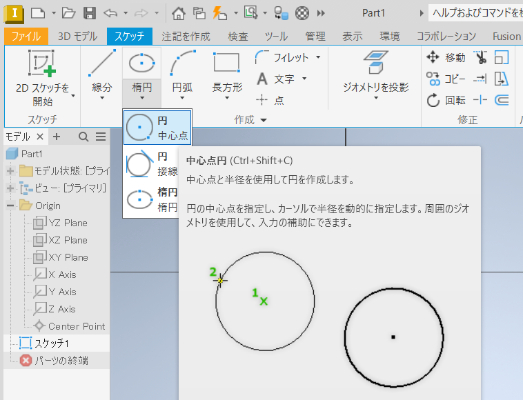
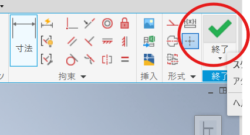
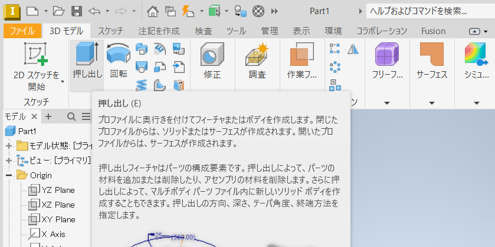
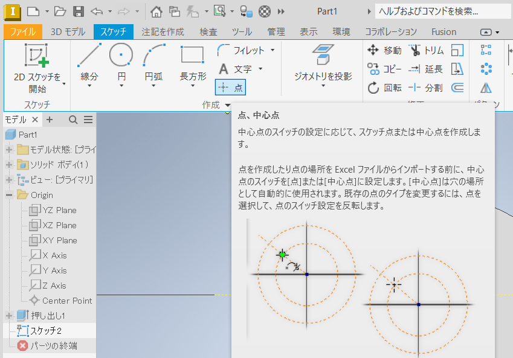

[目次に戻る](./README.md)  
[次に進む](./02.md)

---

# 台座の作成

## モデル・スケッチの新規作成と軸の投影

新規作成をクリックする。

`Standard.ipt`を選択して「作成」をクリックする。

「2Dスケッチを開始」をクリックし、`XZPlane`をクリックする。

「コンストラクション」をクリックする。このボタンが押された状態で作成したスケッチ上の線は立体の作成には影響しない。  
主に補助線を引きたい場合に利用する。

「ジオメトリの投影」をクリックし、`Z Axis`をクリックする。

同じく`X Axis`をクリックする。これにより、`X`軸と`Z`軸が補助線としてスケッチに投影される。

例えば、軸に対して対象に図形を描く、という操作はよくあることである。
そのため、以上の一連の動作はスケッチを作成した際に常に最初に実施しておくとよい。

**最後に「コンストラクション」をクリックするのを忘れないようにすること**

## スケッチ編集画面の操作

- マウスホイールで拡大・縮小。
- マウスホイールを押し込んでのドラッグでスケッチをスクロール。
- スケッチ右上あたりの「上」と書かれた四角の矢印をクリックすることでスケッチを回転。

## 楕円を描く

「円」の下の矢印をクリックし「楕円」をクリックする。

まず、中心をクリックする。

次に、水平に走る軸の上で中心から少し離れた地点をクリックする。

最後に垂直に走る軸の上で中心から少し離れた地点をクリックし、楕円を完成させる。

「寸法」をクリックする。

楕円の右上あたりからドラッグすると寸法指定の線が描かれるので適当な位置で離す。
寸法編集のボックスに`50`と入力しエンターキーを押す。

このとき、スケッチの全体が見えなくなる場合があるが、その際はマウスホイールによる拡大縮小等で調節する。

楕円の右下あたりからドラッグすると寸法指定の線が描かれるので適当な位置で離す。
寸法編集のボックスに`35`と入力しエンターキーを押す。

寸法編集のボックスが出ない場合は「寸法」を再度クリックしてみる。

## 楕円にあける穴を描く

「円」の下の矢印をクリックし「円 中心点」をクリックする。

垂直に走る軸の延長線上をクリックする。

そのままマウスをボタンを押さずに少し動かすと、円の直径を入力できるようになるので`10`と入力する。

「寸法」をクリックし、円の中心と垂直に走る軸をクリックする。
その後、マウスをボタンを押さずに少し動かすと、寸法入力のボックスが出るので、`30`と入力する。

最後に「終了」を押してスケッチ編集を終わる。

## 立体にする

「押し出し」をクリックする。

「距離A」に`5`と入力し、楕円の領域内かつ小さな円の外側をクリックする。

スケッチが厚さ`5mm`の立体になる。

## 台座にネジの穴をあける

立体の上面をクリックし、「2Dスケッチの開始」をクリックする。

「コンストラクション」をクリックして構築ジオメトリを描画するモードにし、`X Axis`と`Z Axis`をジオメトリ投影する。

**「コンストラクション」をクリックして、構築ジオメトリのモードを終了する**

「点」をクリックする

楕円の短辺上の適当な位置をクリックして点を作成する。

「寸法」ボタンをクリックし、作成した点と楕円の長軸をそれぞれクリックすると寸法を指定できるので`22.5`と入力する。

「終了」を押してスケッチ編集を終わる。

「穴」をクリックする。

「ねじ穴」を選択しタイプを`ISO Metric Profile`、サイズを`4`にする。
長さは貫通すればよいので、`5mm`以上にする。
設定したら`OK`をクリックする。

完成したパーツにはタップ（ネジ穴を切る工具）でネジ穴をあける。
通常、タップの下穴はネジのサイズより少し小さいが、`Inventor`でモデルにネジ穴をあけておけば後述する加工機のためのファイルに自動的に小さめの穴が開く。

## ファイルを保存する

「ファイル」をクリックし、「名前を付けて保存」をクリックする。

「ドキュメント」の`Inventor`フォルダに`lecture_cad_01.ipt`というファイル名で保存する。

## レーザ加工用のファイルを出力する。

レーザ加工機は`2`次元`CAD`のファイルである、`DXF`形式に対応している。
この手順で、立体をレーザ加工するための`DXF`を出力する。

作成し終えた立体の上面をクリックしてスケッチを開始する。

「ジオメトリ投影」をクリックして、楕円領域内をクリックする。

黄色い線が楕円と楕円に開けた真円、ネジ穴すべてをなぞるように描かれていることを確認する。

「終了」を押してスケッチ編集を終わる。

先ほど新たに作成したスケッチを右クリックし、「スケッチに名前を付けてエクスポート」をクリックする。

「ドキュメント」の`Inventor`フォルダに`lecture_cad_01.dxf`というファイル名で保存する。

## 材質を設定する

今の段階では完成品のイメージをわかりやすくする程度でそれほど重要ではない。

「材料」の隣にあるアイコンをクリックする。

マテリアルブラウザが開くので「アクリル」を検索する。
「アクリル・クリア」がなければ`AutoDesk Material Library`の「プラスチック」をクリックする（下図参照）。
左のほうにある`lecture_cad_01.ipt`をクリックしてから、「アクリル・クリア」右クリックして「選択項目に割り当て」をクリックする。

実際は材質を設定することで、重さの計算等に使う。

---

[目次に戻る](./README.md)  
[次に進む](./02.md)
