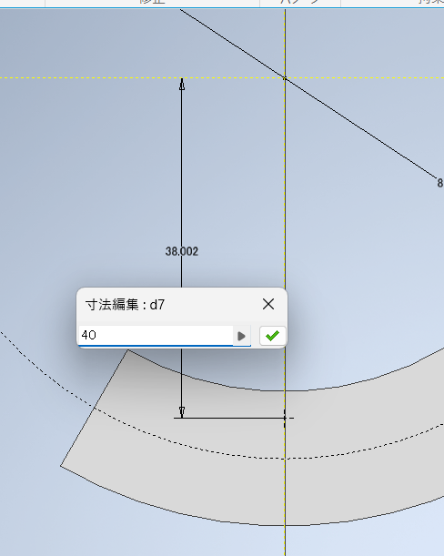
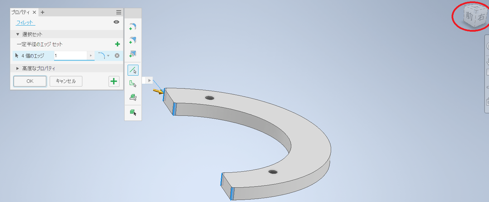

[目次に戻る](./README.md)  
[前に戻る](./01.md)  
[次に進む](./03.md)

---

# 支柱の作成

## モデル・スケッチの新規作成と軸の投影

「新規」をクリックする。

以降、スケッチの作成から軸の投影まで[`lecture_cad_01.ipt`](./README.md#モデルスケッチの新規作成と軸の投影)と同じ。

## 中空の円を描く

「円」の下の矢印をクリックし「円 中心点」をクリックする。

座標軸の交差する中心でマウスをクリックし、そのままボタンを押さずに少し動かすと円の直径を入力できるようになるので`70`と入力する。

もう一度同じように「円 中心点」をクリックし、次は直径`100`の円を描く。

## 円の一部をカットする

「線分」をクリックする。

以下の操作を行うが、寸法や角度を気にせず適当な位置でクリックする。

1. 右上で一度クリックし、
2. 円をカットするように左下でクリックする。
3. 最後にエンターキーを押す。

「一致拘束」をクリックする。

まず、中心の点をクリックし、次に斜めにカットする直線上のどこかをクリックする。

斜めの線が中心に吸い付く。

「寸法」をクリックし、垂直の軸と斜めの線をクリックして角度を`30`度と入力する。

「トリム」をクリックする。

不要な線の上にマウスカーソルを移動させると点線になるので、クリックして線分を削除する。

すべてトリムすると下図のようになる。

「終了」を押してスケッチ編集を終わる。

## 立体にする

「押し出し」をクリックする。

「距離A」に`5`と入力し、図形の内側をクリックする。

スケッチが厚さ`5mm`の立体になる。図は省略する。

## 穴をあける

立体の上面をクリックし、「2Dスケッチの開始」をクリックする。

「コンストラクション」をクリックして構築ジオメトリを描画するモードにし、`X Axis`と`Z Axis`をジオメトリ投影する。

直径`85`の円を描く。

**「コンストラクション」をクリックして、構築ジオメトリのモードを終了する**

「点」をクリックする

垂直に走る軸の上で、円の下のほうをクリックする。

「寸法」をクリックして、水平の軸から点までの距離を`40`とする。

再度「点」をクリックして円の右上あたり、直径`85`の円周上をクリックする。

「寸法」をクリックして、円をカットした線分から点までの距離を`15`とする。

「終了」を押してスケッチ編集を終わる。

「穴」をクリックする。

「ねじ穴」を選択しタイプを`ISO Metric Profile`、サイズを`4`にする。
長さは貫通すればよいので、`5mm`以上にする。
設定したら`OK`をクリックする。

## フィレットを加える

エッジを丸めることである。
材質にもよるが、鋭利な角は危険なことが多いので大抵フィレットを加える。

「フィレット」をクリックする。

半径は`1`として、斜めにカットした断面の長方形における短いほうの辺（`5mm`）をすべてクリックする。
二つの長方形があるので、`4`つの線分にフィレットがかかる。

立体を違う角度から眺めたい場合は、右上のキューブ（下図中の赤丸）の隅をドラッグする。
`4`つの線分にフィレットがかかったら、`OK`をクリックする。

なお、加工機の特性を知った上でフィレットすること。
例えば、レーザ加工するパーツに次のようなフィレットをしても意味がない。

## ファイル保存とレーザ加工用ファイルの出力

前項を参照し、

- パーツは「ドキュメント」の`Inventor`フォルダに`lecture_cad_02.ipt`というファイル名で保存する。
- レーザ加工用ファイルは「ドキュメント」の`Inventor`フォルダに`lecture_cad_02.dxf`というファイル名で保存する。

下図はレーザ加工用のスケッチを投影により作成した状態である。

---

[目次に戻る](./README.md)  
[前に戻る](./01.md)  
[次に進む](./03.md)
