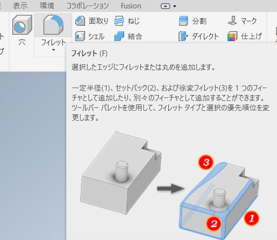

[目次に戻る](./README.md)  
[前に戻る](./02.md)  
[次に進む](./04.md)

---

# ブラケット

異なる部品同士をつなぎ合わせるための部品のことである。
今回はブラケットを`3D`プリントする。

## モデル・スケッチの新規作成と軸の投影

これまでと同じ。最初のスケッチは`XZ Plane`でよい。

下図は`X`、`Z`軸の投影が完了した状態。

## ブラケット底面の作成

原点中心に直径`4.5`の真円を描く。

本作品のねじ止めには`M4`ネジを使う。
`3D`プリント部品の場合`0.5mm`程度は大きめの穴を開けた方が上手く組み立てられる。

「長方形」をクリックする。

円の右上と左下の適当な位置をクリックして長方形を生成し、エンターキーを押す。

「対称」を押す。

以下の順番で線分をクリックする。

1. 一番上
2. 一番下
3. 水平の軸

要は、対称の中心を最後にクリックすればよい。
水平軸を中心に線対称になるはずである。

「寸法」をクリックして、一番上と下の線の間隔を`15`にする。
また、垂直の軸から右端までを`5`左端までを`10`とする。

「終了」を押してスケッチ編集を終わる。

「押し出し」を使い、厚さ`3mm`の立体にする。

## ブラケット側面の作成

立体の上面をクリックしてスケッチを新規作成する。

「長方形」をクリックして、既存の長方形の左上隅をクリックし、下辺のどこかを下図のようにクリックする。

「寸法」をクリックして、新たに作成した長方形の幅を`3mm`にする。

「終了」を押してスケッチ編集を終わる。

「押し出し」で立体にする。距離は`12`。

側面をクリックしてスケッチを新規作成する。

「コンストラクション」をクリックして構築ジオメトリを描画するモードにし、`X Axis`と`Y Axis`をジオメトリ投影する。
これまでと軸が異なるので注意。

**「コンストラクション」をクリックして、構築ジオメトリのモードを終了する**

`Y`軸上に中心を置く直径`4.5mm`の円を描く。

寸法を使い、長方形の下辺から円中心までの距離を`10`にする。

「終了」を押してスケッチ編集を終わる。

押し出しを使い、穴を開ける。

これまでと異なり「ブール演算」で差演算を選択することで穴を開けられる。

## フィレットを加える

「フィレット」をクリックする。

詳細は前項を参照。半径は好みで決めてよい。下図は`2mm`。
強度を増すために、角の内側にフィレットをかけて厚くしている。

## ファイル保存と3Dプリント用ファイルの出力

前項を参照し、パーツを「ドキュメント」の`Inventor`フォルダに`lecture_cad_03.ipt`というファイル名で保存する。

次に、「ファイル」から「エクスポート」、「`CAD`形式」をクリックする。

保存形式に`*.stl`を選択しファイル名を`lecture_cad_03.stl`としてエクスポートする。

---

[目次に戻る](./README.md)  
[前に戻る](./02.md)  
[次に進む](./04.md)
