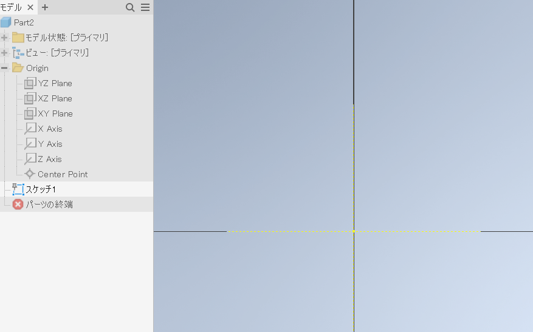
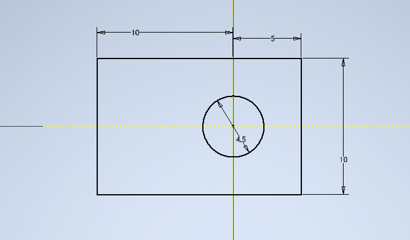
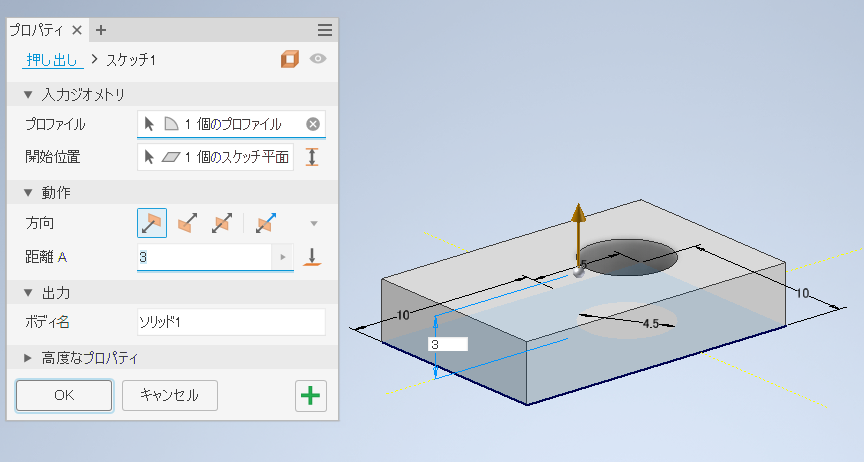
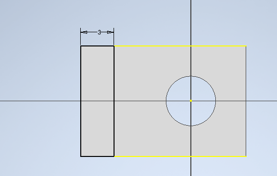
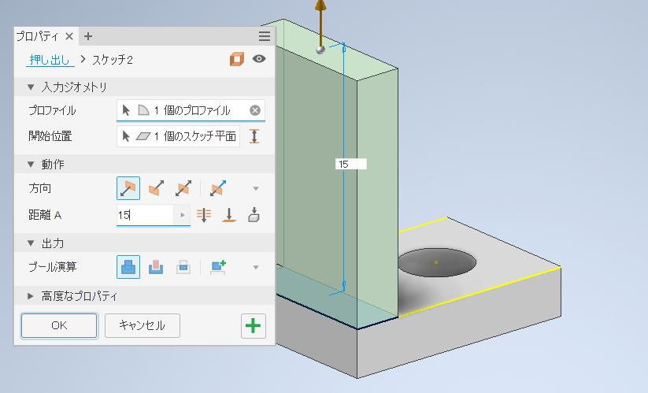
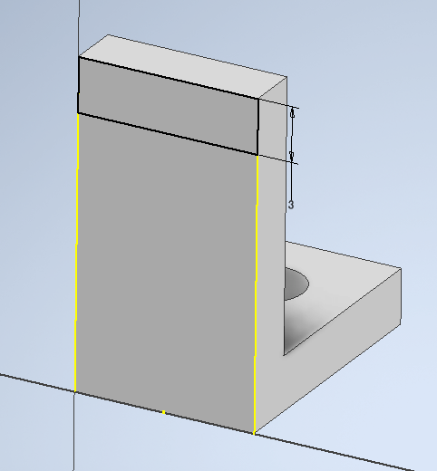
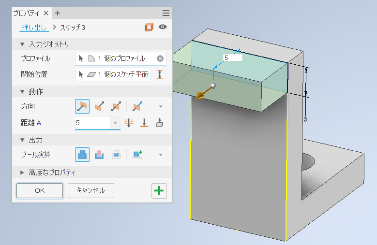
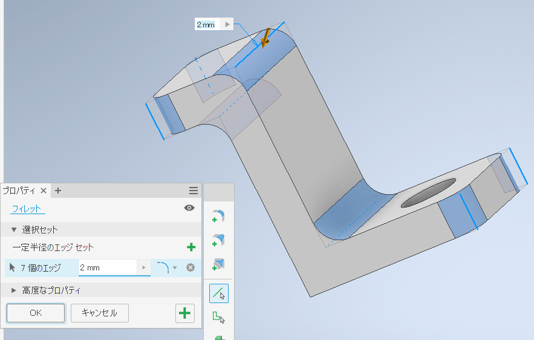

[目次に戻る](./README.md)  
[前に戻る](./03.md)

---

# ペンを置く部分

## モデル・スケッチの新規作成と軸の投影

これまでと同じ。最初のスケッチは`XZ Plane`でよい。

下図は`X`、`Z`軸の投影が完了した状態。

## 底面の作成

ブラケットのときとほぼ同じ下図のようなスケッチ。少し細い。

押し出しもブラケットと同じく厚さ`3㎜`。

立体上面にスケッチを作成し、`10mm x 3㎜`の長方形を作成する。

`15mm`で押し出す。

側面にスケッチを作成し、`10mm x 3㎜`の長方形を作成する。

`5mm`で押し出す。

## フィレットを加える

前項を参照して適宜フィレットを加える。多少増減してもよい。

## ファイル保存と3Dプリント用ファイルの出力

前項を参照し、

- パーツを「ドキュメント」の`Inventor`フォルダに`lecture_cad_04.ipt`というファイル名で保存する。
- 3Dプリント用ファイルを`lecture_cad_03.stl`としてエクスポートする。

---

[目次に戻る](./README.md)  
[前に戻る](./03.md)
