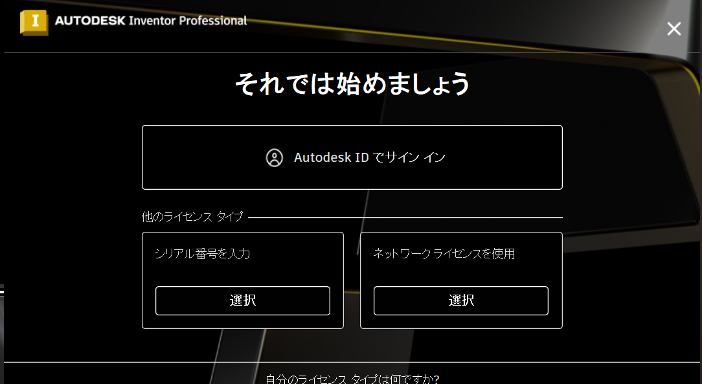
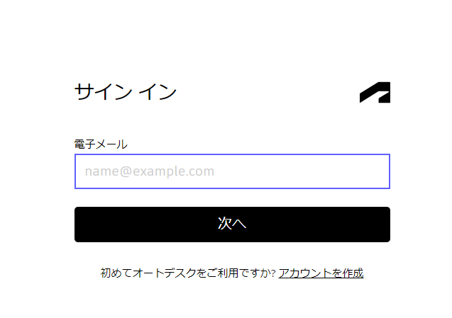
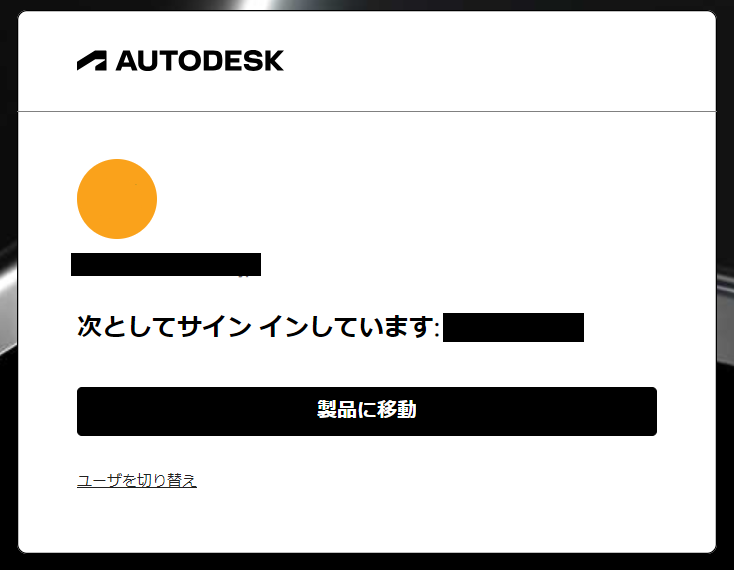
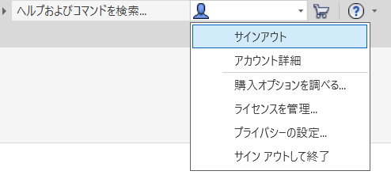

# CAD

[`AutoDesk Inventor`](https://www.autodesk.co.jp/products/inventor/overview)を使って、3Dプリンタとレーザ加工機を使って組み立て可能な物品を製作する。

## AutoDeskアカウントのサインイン

デスクトップ上の`AutoDesk Inventor`アイコンをダブルクリックすると、次のダイアログが開く。「`AutoDesk ID でサインイン`」をクリックして、ブラウザでサインインページを開く。  
直接ブラウザでサインインページが開く場合もある。

登録済みのメールアドレスとパスワードを入力してログインする。

**もしもサインインが促されなかった場合、他人のアカウントを使っている可能性がある。**  
後述する、**サインアウト**をしてからサインインしなおすこと。

サインイン後は「製品に移動」をクリックすると`AutoDesk Inventor`が起動する。ブラウザがリダイレクトの許可を要求した場合は許可すること。

## 製作手順

- [マグネット](./magnet/magnet.md)
- [ペン立て](./pen_holder/pen_holder.md)

## サインアウト

すべての作業が終わったら、必ず
**「サインアウト」**
してソフトを終了させること。

