[目次に戻る](./magnet.md)  
[前に戻る](./01.md)  
[次に進む](./03.md)

---

# 装飾部の作成

装飾部分は`3D`プリントする。
「ファイル」メニューから「新規」をクリックして`Standard.ipt`から新しいパーツを作成する。

## モデル・スケッチの新規作成と軸の投影

これまでと同じ。最初のスケッチは`XZ Plane`でよい。

下図は`X`、`Z`軸の投影が完了した状態。

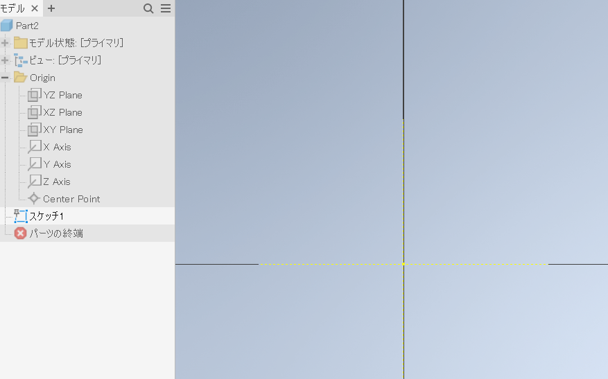

分かりにくいので、スケッチの「上」がスクリーンの上と一致するように回転しておくこと。

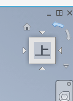

## 長方形の作成

[磁石側プレート](./01.md)と同じ大きさの幅`50mm`、高さ`30mm`の長方形を作成する。
上下、左右の辺は中心軸に対し対称拘束を入れておくこと。

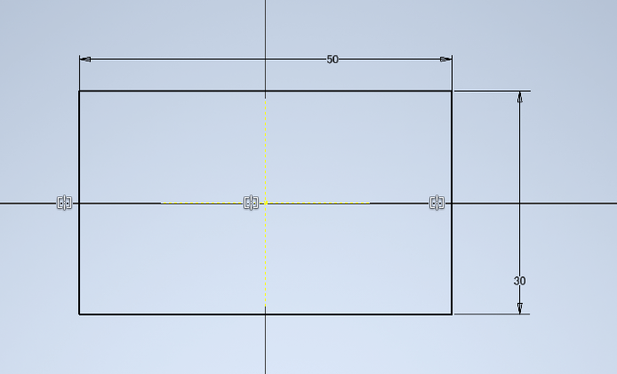

長方形の隅に直径`3.2`の真円を描く。

本作品のねじ止めには`M3`ネジを使う。
`3D`プリント部品の場合`0.2mm`程度は大きめの穴を開けた方が上手く組み立てられる。

円をクリックする。

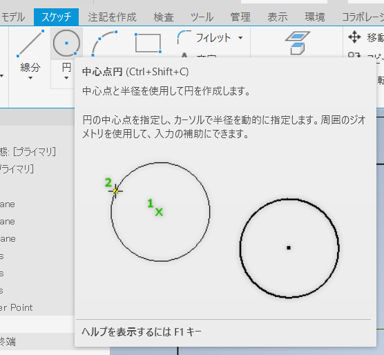

長方形の隅の適当な位置をクリックする。

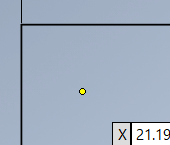

マウスカーソルを移動して適当な大きさの円を生成し、再度クリックする。

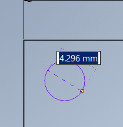

ネジ穴を作ったときと同じ要領で、円の中心が長方形の上と左の円から`4mm`の位置になるように拘束する。

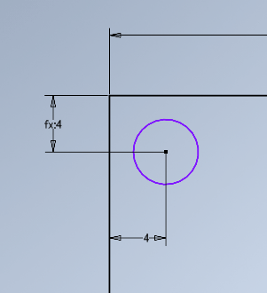

寸法ボタンを押し、円の輪郭をクリックする。

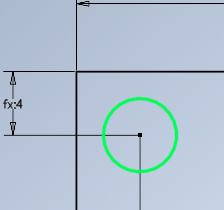

円の直径を入力できるので`3.2mm`にする。

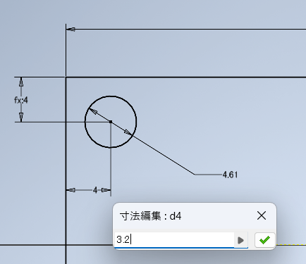

[磁石側プレート](./01.md)と同様に円を4隅にミラーする。

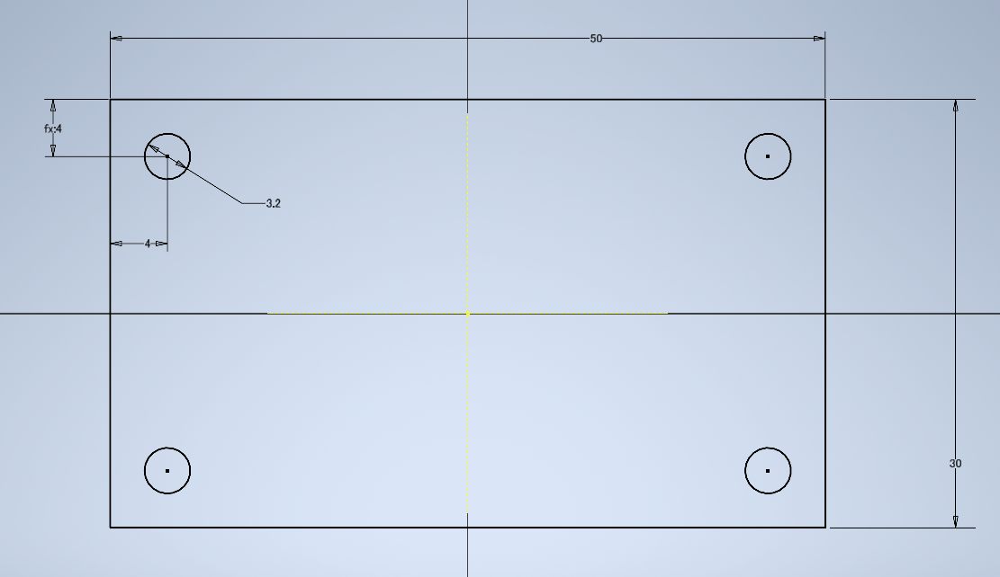

「終了」を押してスケッチ編集を終わる。

「押し出し」を使い、厚さ`3mm`の立体にする。

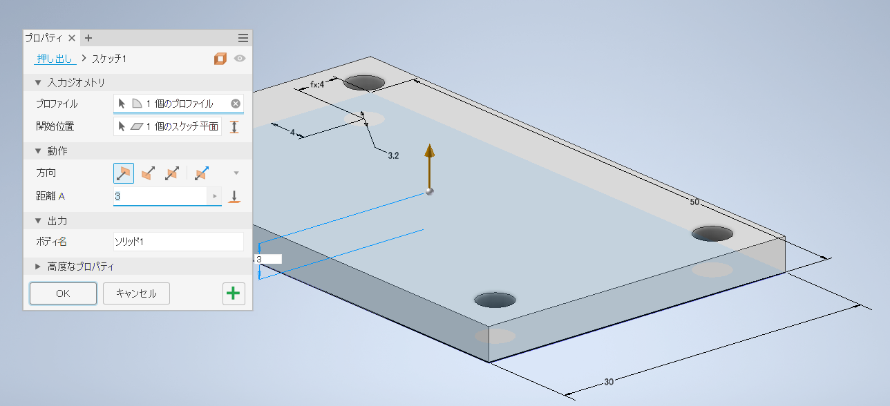

## 装飾の作成

立体の上面をクリックしてスケッチを新規作成する。

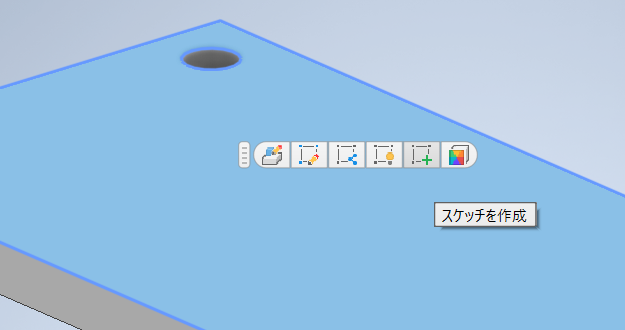

作成後はコンストラクションボタンとジオメトリ投影を使って`X`、`Z`軸を投影しておくこと。

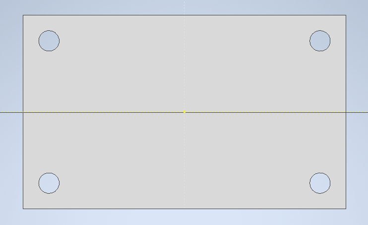

装飾としてへこませる図形をスケッチする。寸法等は適当で良いし、好きな図形でも良い。
ただし、以降の演習の都合上、あまり長方形の淵と図形の端は`4mm`程度はあけておくこと。

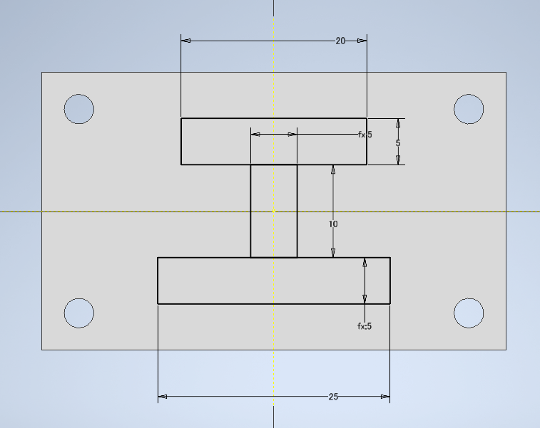

「終了」を押してスケッチ編集を終わる。

先ほど作成した装飾用スケッチをクリックしてから「押し出し」を押す。
ブール演算のところで「切り取り」をクリックし、距離を`2mm`にしてへこませる図形をクリックしていく。

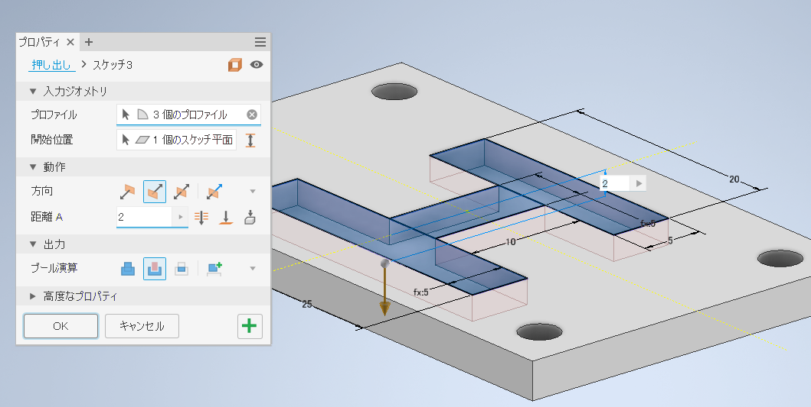

フィレットを押す。

半径`2mm`のフィレット加工を4隅に施す。

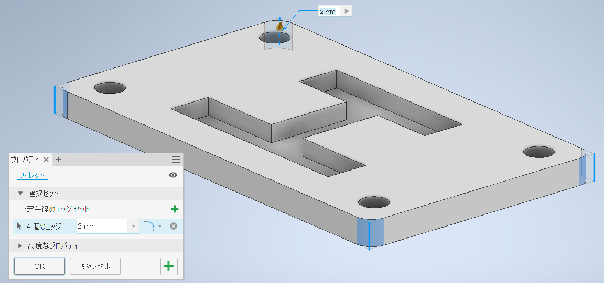

再度フィレットを押す。
次は半径`1mm`にして、上面の4辺のうちいずれかをクリックすると上面と側面の境界にフィレットがかかる。
装飾のへこみにフィレットをしても良い。
間違えた辺にフィレットをした場合は`Shift`キーを押しながら辺をクリックする。

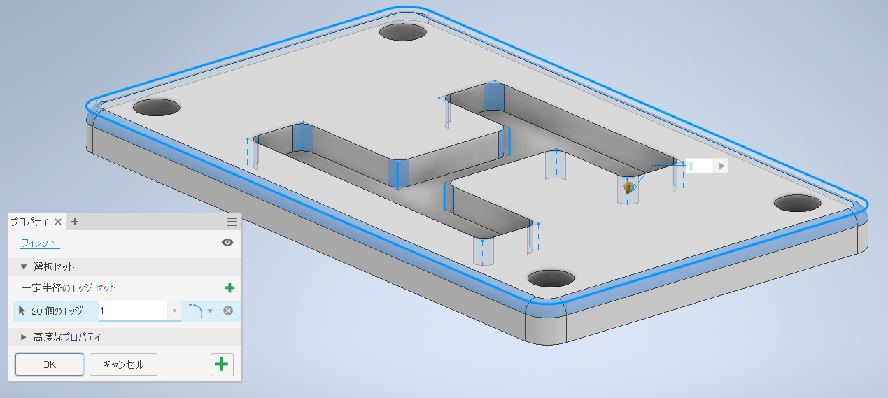

## ファイル保存と3Dプリント用ファイルの出力

前項を参照し、パーツを「ドキュメント」の`Inventor`フォルダに`magnet_02.ipt`というファイル名で保存する。

次に、「ファイル」から「エクスポート」、「`CAD`形式」をクリックする。

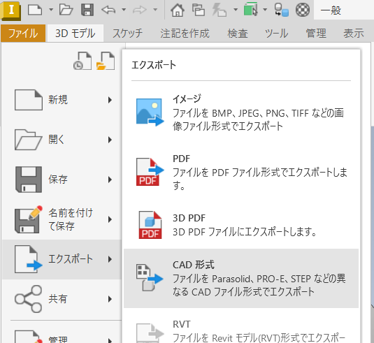

保存形式に`*.stl`を選択しファイル名を`magnet_02_print.stl`としてエクスポートする。

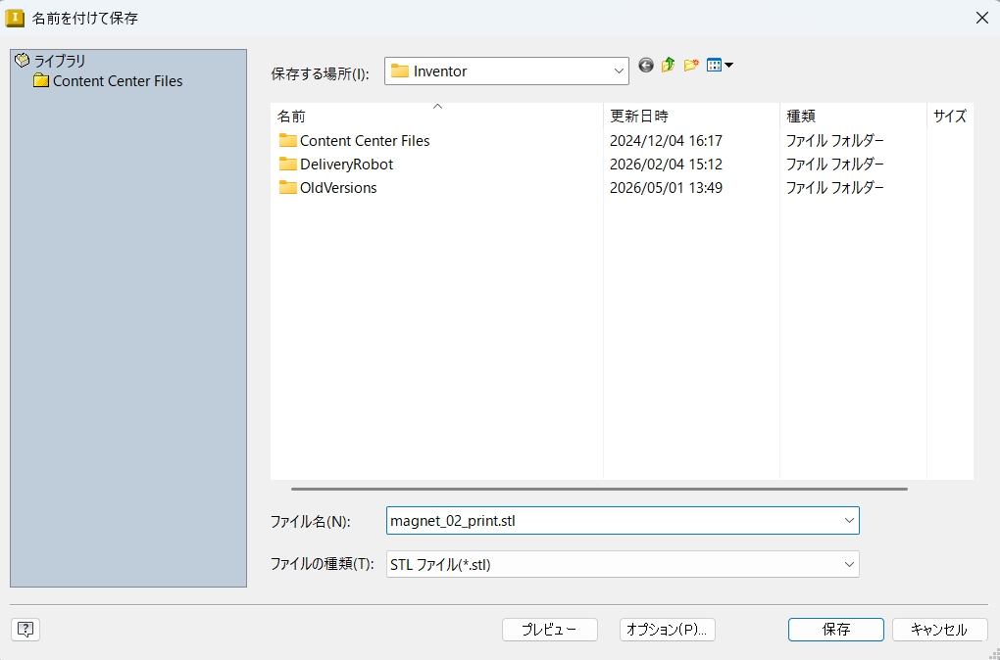

---

[目次に戻る](./magnet.md)  
[前に戻る](./01.md)  
[次に進む](./03.md)
