[目次に戻る](./magnet.md)  
[前に戻る](./02.md)  
[次に進む](./04.md)

---

# アセンブリの作成

複数のパーツを組み合わせたものを「アセンブリ」という。

アセンブリでも「拘束」が重要である。
パーツ同士を「固定」したり、ネジ穴同士を「同軸」に揃えたりすることで、画面上でバーチャルに組み立てることができる。

これにより、実際に作品を組み立てる前に、部品が干渉（ぶつかること）していないか、ネジの長さが足りているかといった 「仕上がりの精度」 を事前に確認できる。

## 磁石側プレートの配置

「ファイル」メニューから「新規」をクリックして「アセンブリ」の`Standard.iam`を選択し、作成する。

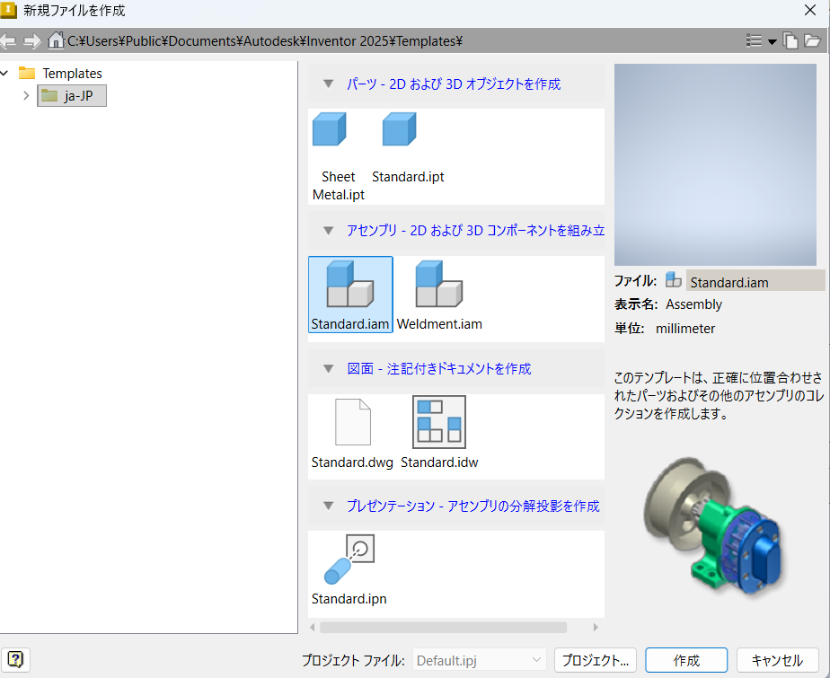

「配置」をクリックしドキュメントフォルダの`Inventor`に保存されている`magnet_01.ipt`を開く

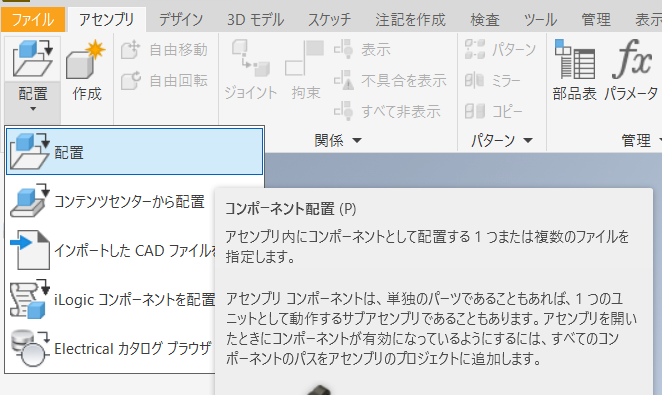

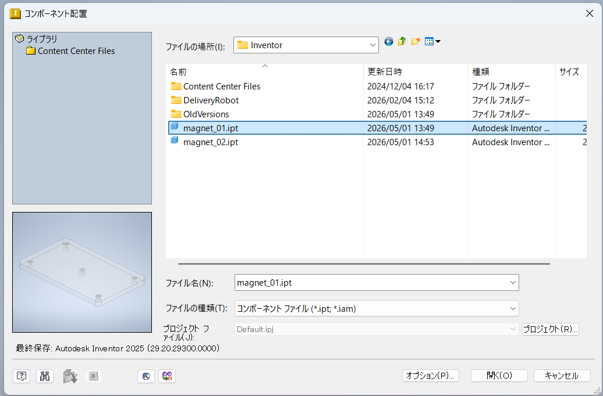

3次元ビュー内にパーツがあらわれるので、適当な位置で1回だけクリックする。
複数回クリックすると何個も出てくるので、1回クリックしたら`ESC`キーで終了する。

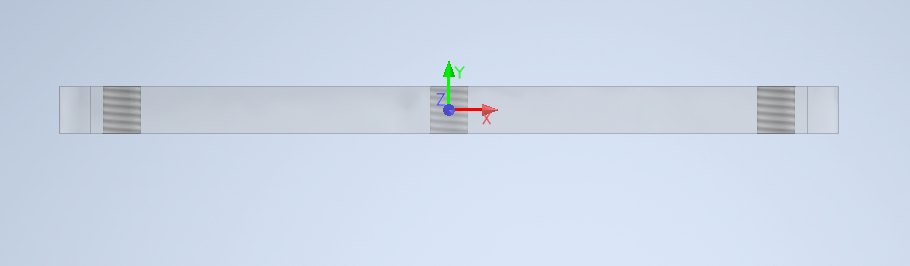

パーツの軸とアセンブリの軸をあわせる。
画面左側から`Assembly1`の`Origin`と`magnet_01`の`Origin`を開き、`Ctrl`キーを押しながら両方の`YZ Plane`をクリックする。

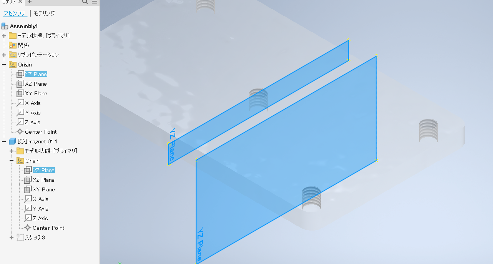

「拘束」を押す。

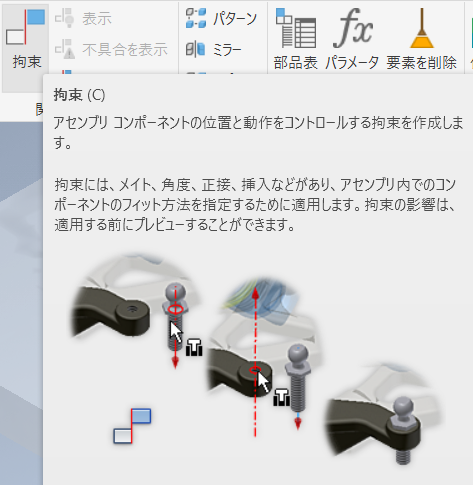

「フラッシュ」を選択して「適用」を押す。

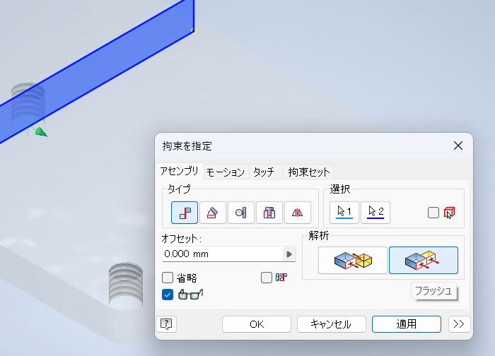

同様に`XZ Plane`、`XY Plane`も拘束する。

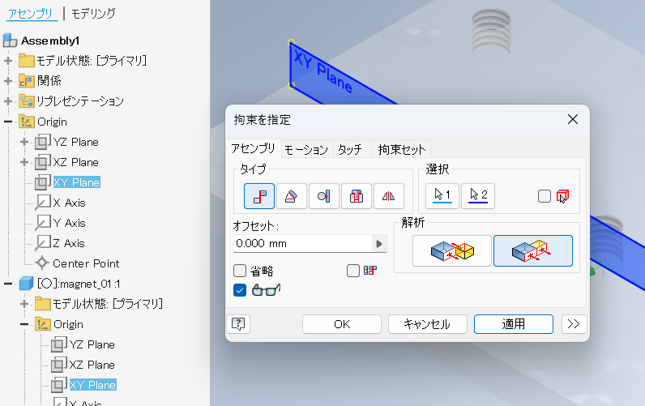

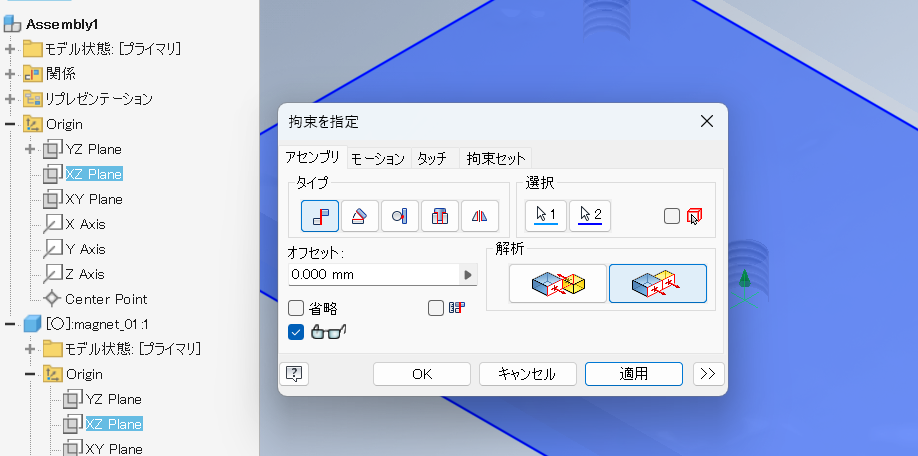

## 装飾部の配置

同じ要領で、`magnet_02.ipt`を配置する。

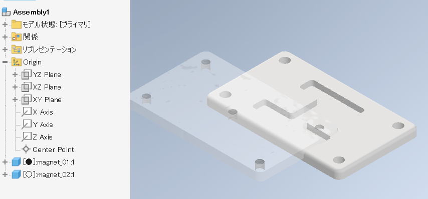

「拘束」を押して「挿入」を選択する。

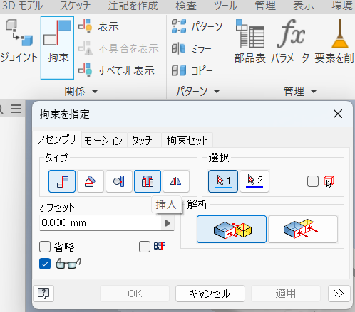

「拘束」を押して「挿入」を選択する。

最初に`magnet_01.ipt`の穴を一つクリックする。

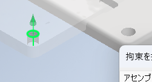

次に`magnet_02.ipt`の穴を下側からクリックする。
クリックするのは、組み立てた際に重なる穴である。

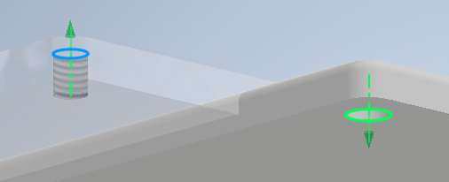

適用を押すと穴同士がつながり、拘束される。

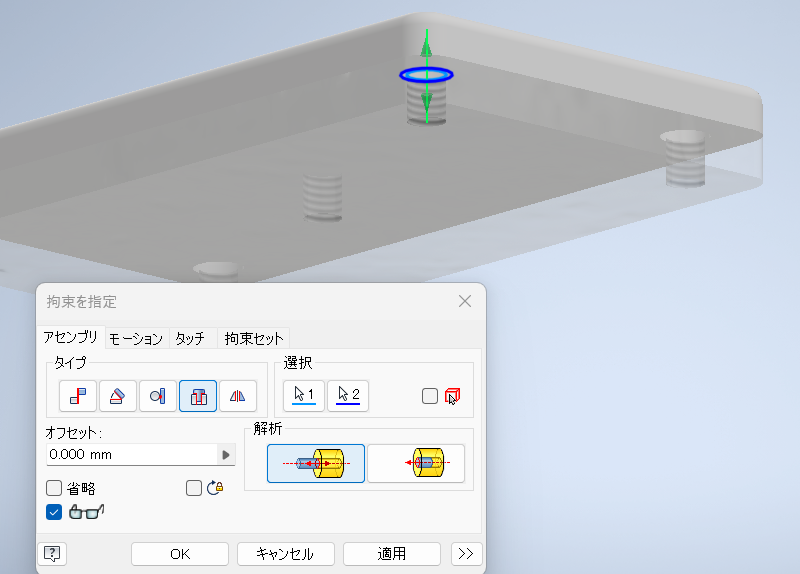

画面左側の部品一覧にある`magnet_02.ipt`以下の拘束「挿入:1」を探す。
表示されていない場合は`magnet_02.ipt`左の`+`マークを押す。
「挿入:1」を右クリックして「省略」を押す。

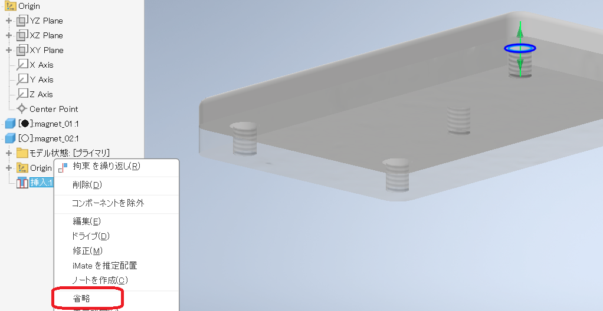

すると`magnet_02.ipt`が自由に動かせるようになる。

先ほどと同じ要領で、拘束していないネジ穴（どれでも良いができれば先ほど拘束した穴の対角）同士を拘束する。

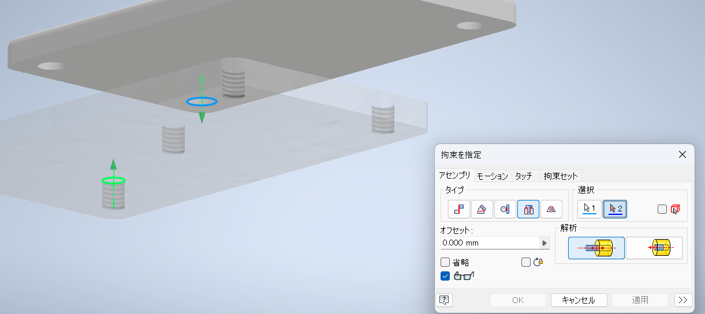

拘束したら、省略していた「挿入:1」を右クリックして「省略」を解除し再び有効にする。
これで、装飾部を移動させることはできないはずである。

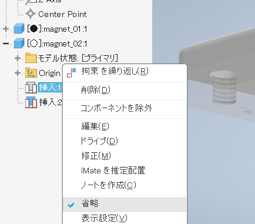

# 保存

ファイルメニューから名前を付けて保存を実行し`magnet.iam`で保存する。

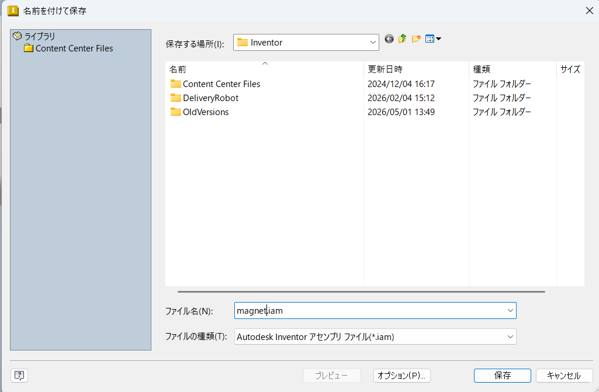

---

[目次に戻る](./magnet.md)  
[前に戻る](./02.md)  
[次に進む](./04.md)
